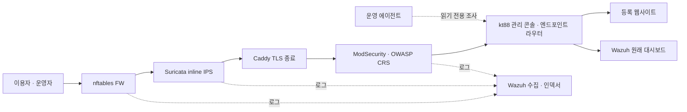

# kt88 · 보안 인프라와 에이전트 운영 플랫폼

kt88은 웹사이트를 등록하면 방화벽·IPS·웹방화벽을 통과하는 경로로 서비스하고, 사람과 에이전트가 함께 관제하는 독립 플랫폼입니다. kt66의 조직·팀·에이전트·스킬 관리와 실행 증적 화면을 계승했으며, 실행에 필요한 코드와 설정은 이 저장소에서 관리합니다.

전산실의 **실제 네트워크 구성도와 NMS/SMS**, 운영사무실의 **팀·담당자·조사 실행 현황**을 하나의 운영 콘솔에서 제공합니다. 취약 엔드포인트, Exchange 실습, 장애 주입과 시설 고장 시뮬레이터는 배포 구성에서 제외했습니다.

> 문서 기준: 2026-10-09 · [설치·운영 상세](docs/OPERATIONS.ko.md) · [아키텍처](docs/ARCHITECTURE.ko.md)

## 주요 기능

| 영역 | 현재 제공하는 기능 |
| --- | --- |
| 웹사이트 연결 | GUI에서 내부 HTTP upstream과 내부/public 도메인 등록·삭제, 상태 점검, 호스트명 기반 라우팅 |
| 네트워크·시스템 관제 | 장비를 클릭하는 구성도, 주요 상황 대시보드, 인터페이스·IP·라우팅·트래픽·오류, 호스트/컨테이너 자원과 서비스 응답 |
| FW · nftables | 출발 IPv4/CIDR 기준 허용·차단·거부 정책 등록·수정·중지·삭제, 패킷 카운터, 로그 |
| IPS · Suricata | 인라인 탐지·차단, ET Open, 간편 정책, **Suricata 규칙 전문 편집과 별도 `local.rules` 관리** |
| WAF · ModSecurity/OWASP CRS | IP·경로·User-Agent 정책, CRS 검사 강도·차단 점수, 로그, 적용 상태 |
| Wazuh SIEM | 경보 조회·필터, 최고 관리자용 원래 대시보드와 Discover 검색을 콘솔 안에서 열기 |
| 에이전트 운영 | 조직·팀/KPI·에이전트/R&R·담당 자산·스킬 관리, 정기/즉시 조사, 실행 증적과 설정 복원 이력 |
| API·MCP | 관리 REST API, 읽기 전용 MCP `platform_health`, 에이전트용 상태·경보 조회 API |

정책은 변경안 검토, 버전 충돌 확인, 엔진 구문 검사와 적용 결과 확인을 거칩니다. 저장 완료와 실제 장비 적용 완료를 구분해 표시합니다.

## 트래픽 경로



- 공개 진입점은 기본 TCP 80/443입니다. 웹사이트 컨테이너의 포트를 호스트에 직접 공개하지 않습니다.
- IPS는 TLS 종료 전 구간을 검사합니다. 암호화된 HTTPS 본문은 TLS 종료 뒤 WAF에서 검사합니다.
- IPS 엔진이 중단되면 NFQUEUE는 우회 통과하지 않고 트래픽을 차단합니다.
- 웹사이트 upstream은 기본 `10.88.40.0/24` 앱 네트워크로 제한하며, 등록 시와 연결 시 DNS/IP를 검사합니다.

## 설치와 첫 접속

### 준비

- Debian 또는 Ubuntu Linux 호스트, `sudo` 권한과 인터넷 연결
- Docker Engine 및 `gw_priority`를 지원하는 Docker Compose (`docs/OPERATIONS.ko.md`의 버전 안내 참고)
- nftables, bridge 및 NFQUEUE를 사용할 수 있는 커널
- 사용할 웹 포트와 `10.88.30.0/24`~`10.88.34.0/24`, `10.88.40.0/24`, `10.88.60.0/24` 대역의 충돌 여부 확인

설치기는 Docker가 없으면 설치하고, 이미지·ET Open 규칙·Wazuh 배포 파일을 내려받습니다. Wazuh의 데이터 증가를 고려해 메모리와 저장 공간을 준비하세요. 라우팅을 위해 호스트의 `net.bridge.bridge-nf-call-iptables=0`과 Docker 서비스 시작 후 적용 설정을 사용하므로, 기존 bridge 방화벽에 의존하는 워크로드와는 호스트를 분리하는 구성이 적합합니다.

```bash
git clone https://github.com/mrgrit/kt88.git
cd kt88
sudo ./setup.sh
```

초기 비밀번호는 설치 중 입력합니다. 기본 계정명은 `admin`이며 최초 로그인에서 비밀번호를 변경해야 합니다. 배포물에 공용 비밀번호나 특정 조직의 도메인·계정을 넣지 않습니다.

| 설치 옵션 | 의미 |
| --- | --- |
| `--internal-domain ops.example.internal` | 관리용 내부 호스트명. `.internal`로 끝나야 함 |
| `--admin-user operator-admin` | 최초 관리자 계정명 |
| `--admin-password-file /secure/path/password` | 대화형 입력 대신 초기 비밀번호 파일 사용 |
| `--web-bind 192.0.2.10` | 웹 포트를 바인딩할 호스트 주소 |
| `--http-port 8080 --https-port 8443` | 기본 80/443 대신 사용할 호스트 포트 |
| `--without-siem` | Wazuh를 제외하고 설치 |
| `--prepare-only` | 로컬 설정·작업공간 준비까지만 실행. 서비스 배포 제외 |

기존 `.env`, 비밀번호 및 편집한 에이전트 정의는 재실행 시 보존합니다. 옵션을 바꿔 재실행하는 것만으로 기존 `.env`가 갱신되지는 않습니다.

1. 서버 주소를 DNS 또는 접속할 컴퓨터의 hosts에 `platform.example.internal`로 연결합니다.
2. 내부 CA의 **공개 인증서**를 내보내 접속할 컴퓨터의 신뢰 저장소에 설치합니다.
3. `https://platform.example.internal/_kt88/`에 접속해 초기 비밀번호를 변경합니다. 다른 HTTPS 포트를 선택했다면 주소에 해당 포트를 붙입니다.

```bash
sudo docker compose cp edge:/data/caddy/pki/authorities/local/root.crt .runtime/internal-root.crt
```

공개 도메인이 없어도 내부 도메인과 내부 CA로 사용할 수 있습니다.

## 자신의 웹사이트 연결

1. 웹사이트 컨테이너를 `apps` 네트워크에 연결합니다. 별도 Compose 프로젝트라면 kt88 기본 프로젝트의 네트워크 이름은 `kt88_apps`입니다.
2. 운영 콘솔 → **웹사이트 연결**에서 도메인과 `http://서비스이름:포트`를 등록합니다.
3. 내부 서비스는 `.internal` 도메인, 외부 공개 서비스는 보유한 public 도메인을 선택합니다.
4. DNS/hosts와 인증서, 실제 웹 접속 및 콘솔의 서비스 응답을 확인합니다.

별도 웹사이트 Compose 프로젝트에서 기존 네트워크를 사용하는 예입니다. `website`의 이미지·설정은 실제 애플리케이션에 맞게 작성합니다.

```yaml
services:
  website:
    image: your-registry/your-website:your-version
    networks: [kt88_apps]
    # host ports를 공개하지 않고 GUI에 http://website:8080 등을 등록합니다.
networks:
  kt88_apps:
    external: true
    name: kt88_apps
```

public 도메인의 A/AAAA 레코드는 서버의 실제 연결 구성과 일치해야 합니다. 등록된 도메인만 Caddy의 on-demand 인증서 발급 대상으로 허용하며, 내부 도메인의 라우트와 인증서는 등록 후 자동 반영합니다. 필요하면 `.env`의 `ACME_EMAIL`을 설정합니다. 콘솔의 upstream 응답 정상은 공개 DNS·인증서·외부 접속까지 검증했다는 뜻은 아닙니다.

## 운영 콘솔과 권한

| 화면 | 경로 / 사용 방법 |
| --- | --- |
| 네트워크·관제, 보안 장비, 웹사이트, 사용자·감사 | `/_kt88/` |
| Wazuh 전체 화면 | SIEM 경보 → **Wazuh 화면 열기**, 또는 `/_kt88/wazuh/` |
| 조직·팀·에이전트·스킬 | 에이전트 → **조직·팀·에이전트·스킬**, 또는 `/_kt88/agentops/` |
| 에이전트 실행 증적 | 에이전트 → **에이전트 관제**, 또는 `/_kt88/evidence/` |
| API 문서 / OpenAPI | `/_kt88/docs`, `/_kt88/openapi.json` |

| 권한 | 주요 허용 작업 |
| --- | --- |
| `admin` | 사용자·웹사이트·보안 정책·에이전트 정의·스킬 관리, 조사 실행, Wazuh 전체 화면 |
| `operator` | 관제·로그·실행 증적 조회, 즉시 조사 요청 |
| `viewer` | 관제·로그·실행 증적 조회 |

Wazuh 전체 화면은 관리 기능을 포함하므로 최고 관리자만 사용합니다. 일반 운영자와 읽기 전용 사용자는 kt88의 제한된 경보 조회 화면을 이용합니다. Wazuh 서비스는 내부 management 네트워크에 있고, 대시보드의 호스트 바인딩은 `127.0.0.1:5601`입니다.

장비 화면에는 **대시보드 / 정책 관리 / 로그 / 인터페이스·IP·경로** 탭이 있습니다. 네트워크 구성도에서 장비를 선택해 같은 화면으로 이동할 수 있습니다. NMS/SMS는 플랫폼 장비와 호스트의 실제 측정값을 보여주며 외부 SNMP 장비 자동 탐색 기능은 포함하지 않습니다. 화면은 15초 간격으로 갱신하고 45초가 지난 측정은 수집 지연으로 표시합니다.

## Suricata 규칙 전문과 `local.rules`

**FW·IPS·WAF → IPS → 정책 관리 → Suricata 사용자 규칙 · local.rules**에서 규칙 전문을 입력합니다.

1. 전문을 붙여넣거나 수정합니다. 줄 앞의 `#`으로 중지하고, 해당 줄을 지워 삭제할 수 있습니다.
2. **구문 검사**를 눌러 실제 엔진에서 ET Open·기본 규칙·간편 정책과 함께 검사합니다.
3. 검사 결과와 변경 내용을 확인한 뒤 **검사한 local.rules 저장·적용**을 누릅니다.
4. 엔진 적용 완료 또는 오류를 확인합니다. 오류 시 기존 실행 규칙을 유지합니다.

| 파일 | 용도 |
| --- | --- |
| `.runtime/policies/local.rules` | 호스트의 저장된 사용자 전문 규칙. 컨테이너에서는 `/policies/local.rules` |
| IPS의 `/opt/local.rules` | 검사와 적용 절차를 거쳐 엔진이 사용하는 사용자 전문 규칙 |
| IPS의 `/opt/ips-active.rules` | 기본 운영 규칙과 GUI 간편 정책으로 생성한 규칙 |
| IPS의 `/var/lib/suricata/rules/suricata.rules` | 이미지 빌드 시 받은 ET Open 규칙 |

사용자 전문 규칙은 엔진의 `rule-files`에 별도로 등록되며 ET Open과 분리됩니다. 웹 편집기 한도는 UTF-8 **256 KiB**입니다. SID는 중복 없이 지정하며 `9000000` 이상을 권장합니다. 높은 `rev`로 기본 규칙의 SID를 덮어쓰는 경우도 거부합니다. 검사 결과는 10분간 유효하고, 그 사이 정책이 바뀌면 다시 검사합니다.

빈 파일 적용은 전문 사용자 규칙을 모두 제거합니다. `lua`, `luajit`, `dataset` 규칙은 웹 편집기에서 제한하며 콘솔에서 별도로 관리해야 합니다. 파일 해시와 정책 버전을 함께 관리하므로 호스트 파일만 직접 수정하지 말고 GUI의 검사·적용 절차를 사용하세요.

## Wazuh와 WAF 운영

Wazuh manager/indexer/dashboard는 설치 시 고정된 공식 Docker 배포를 준비합니다. FW 카운터, Suricata EVE 및 ModSecurity 감사 로그를 수집하며, 장비 로그 화면에서 기간·심각도·출발 IP로 조회합니다. FW 로그는 현재 차단 카운터 집계이므로 패킷별 출발 IP가 없는 항목은 IP 검색에 나타나지 않습니다.

CRS 기본값은 검사 강도 2, 요청 차단 점수 5, 응답 차단 점수 4입니다. GUI에서 검사 강도와 요청 차단 점수를 조정할 수 있습니다. WAF를 전역 탐지 전용으로 바꾸는 방식 대신 다음의 확인된 관리 요청에만 제한된 예외를 적용합니다.

- Wazuh 인덱스 패턴 등록의 필드 메타데이터
- Discover 검색의 지정된 하이라이트 필드가 `2147483647`인 경우
- IPS 규칙 검사 API의 Suricata 전문 `content` 필드

경로·메서드·필드에 제한된 예외이며 관리 인증과 나머지 검사는 유지합니다. 일반 비파일 요청 본문 한도는 2 MiB, Wazuh 인덱스 패턴 등록 경로는 4 MiB입니다. 구현은 [ModSecurity 설정](security/modsecurity.conf), [WAF 프록시 설정](security/waf.conf)에 있습니다.

## 에이전트 팀·스킬·실행 증적

조직 → 팀/KPI → 에이전트/R&R → 담당 자산·스킬 → 정기 작업의 흐름으로 운영합니다. 기본 역할은 `platform-health`와 `soc-triage`입니다. 관리자는 정의와 스킬을 편집하고, 관리자/운영자는 즉시 조사를 요청할 수 있습니다. 정기 실행 주기는 역할별로 설정합니다.

실행 기록에는 당시 정의·권한, 요청, 읽은 스킬의 해시, 실제 도구 조회 응답, 모델 사용량과 결과를 남깁니다. 보고서는 검토할 초안이며 실행기에 정책 적용·임의 셸·Docker socket 권한을 제공하지 않습니다. 모델과 연결 스킬을 바꾸어도 서버가 정한 조회 도구 범위가 넓어지지 않습니다.

서버의 작업공간은 `.runtime/agent-workspace/`이며, 컨테이너에는 `/workspace`로 마운트합니다.

```text
.runtime/agent-workspace/
├── AGENTS.md
├── CLAUDE.md
├── .claude/
│   ├── agents/<id>.md             # 에이전트 정의 원본
│   └── skills/<name>/SKILL.md     # Claude용 반영본
├── .agents/skills/<name>/SKILL.md # 스킬 원본 · Codex에서 사용
├── .codex/agents/<id>.toml        # Codex용 반영본
└── .hermes/profiles/<id>/
    ├── config.yaml
    ├── SOUL.md
    └── skills/<name>/SKILL.md
```

표준 파일은 초기화와 GUI 저장 과정에서 생성·반영합니다. 조직·팀·KPI 및 복원 이력은 플랫폼 SQLite에 저장합니다. 재설치는 편집한 정의를 덮어쓰지 않습니다. 이 구조를 제공하는 것과 Claude Code/Codex/Hermes CLI를 자동으로 실행하는 것은 별개이며, 현재 자동 운영 실행기는 **Ollama API**를 사용합니다.

### 오픈모델 연결

모델은 별도 서버 또는 추론 컨테이너에 준비합니다. `models` 내부 네트워크에서 도달할 수 있는 추론 서비스/게이트웨이를 연결한 뒤 `.env`를 설정합니다. 외부 모델 서버를 사용하는 경우 해당 서버까지의 연결 경로도 별도로 구성해야 합니다.

```dotenv
LLM_URL=http://ollama:11434
LLM_MODEL=qwen3:8b
AGENT_MODELS=qwen3:8b,qwen3:14b
# 게이트웨이의 Host 헤더가 필요한 경우에만 설정
# MODEL_HTTP_HOST=model.example.internal
```

위 모델명은 설정 예이며 모델을 내려받거나 성능을 보증하는 설정이 아닙니다. 실제 준비한 모델만 허용 목록에 넣으세요. `LLM_URL`이 설정된 기본 SIEM 포함 설치에서는 운영 실행기도 시작합니다. 기존 설치에서 설정을 변경했다면 아래 전체 Compose 조합으로 `control`, `operation-agents`를 다시 생성합니다.

```bash
sudo docker compose -f compose.yaml -f compose.agents.yaml \
  -f .runtime/siem/compose.overlay.yaml up -d --build control operation-agents
```

모델 호스트의 로컬 Ollama에 연결하는 [벤치마크 스크립트](scripts/benchmark_models.py)도 제공합니다. 한국어 JSON 응답, 제공 사실 준수, 주입 지시 처리, 도구 호출과 지연 시간을 측정하며 결과는 실행 디렉터리의 `benchmark-results.json`에 저장합니다.

## REST API와 MCP

- 관리 REST API: `/_kt88/api/*` — 세션, 역할 및 쓰기 요청의 동일 출처·CSRF 검사
- 에이전트 상태 조회: `GET /_kt88/agent/health`
- 에이전트 경보 조회: `GET /_kt88/agent/siem`
- MCP: `POST /_kt88/mcp` — Bearer 서비스 토큰 인증, JSON-RPC, 현재 제공 도구는 읽기 전용 `platform_health`

서비스 토큰은 `.secrets/agent_token`에서 공급합니다. 사용자 관리 세션과 분리하며 브라우저 코드나 저장소에 넣지 않습니다. 모델에게 인증정보를 전달하지 않고 실행기가 허용된 도구를 대신 호출합니다.

## 운영 명령과 데이터 보관

기본 SIEM 포함 설치는 다음 Compose 조합을 사용합니다. `compose.siem.yaml`은 안내용 파일이며 실제 Wazuh 구성은 설치기가 생성한 overlay입니다.

```bash
sudo docker compose -f compose.yaml -f compose.agents.yaml \
  -f .runtime/siem/compose.overlay.yaml ps

sudo docker compose -f compose.yaml -f compose.agents.yaml \
  -f .runtime/siem/compose.overlay.yaml logs --tail=100 control ips waf
```

SIEM 제외 설치는 `docker compose -f compose.yaml`을 사용합니다. 정책의 실제 적용 상태와 에이전트 실행 기록은 운영 콘솔에서 확인합니다.

| 보관 위치 | 내용 |
| --- | --- |
| `.env`, `.secrets/` | 설치 환경과 인증정보 |
| `.runtime/data/` | 계정, 등록 서비스, 조직, 실행·감사·관제 이력의 SQLite |
| `.runtime/policies/` | 보안 정책, `local.rules`, 생성 설정과 장비 상태 |
| `.runtime/agent-workspace/` | 에이전트 정의와 스킬 |
| `.runtime/logs/` | FW·IPS·WAF 로그 |
| `.runtime/siem/`, `.runtime/certs/` | Wazuh 설치 설정과 인증서 |
| Docker named volumes | Caddy CA/인증서 및 Wazuh 영속 데이터 |

SQLite는 online backup 방식으로, Wazuh는 snapshot 방식으로 백업하고 설정·정책·인증정보도 암호화 보관합니다. 다른 호스트에서 복구를 확인하세요. `docker compose down -v`는 영속 데이터를 삭제하므로 운영 종료·업데이트 명령으로 사용하지 않습니다. runtime과 비밀 파일은 Git에서 제외합니다.

## 검증

플랫폼 테스트는 Python 3.12 환경에서 실행합니다.

```bash
python3 -m venv .venv
.venv/bin/pip install -r control/requirements.txt pytest
.venv/bin/python -m pytest tests
```

배포 후에는 설정 검사와 실제 트래픽 경로 검증을 수행합니다.

```bash
sudo docker compose -f compose.yaml -f compose.agents.yaml \
  -f .runtime/siem/compose.overlay.yaml config --quiet

bash scripts/verify-path.sh platform.example.internal 127.0.0.1
.venv/bin/python scripts/verify-discover-waf.py https://platform.example.internal
```

검증 스크립트는 UI 접속, CRS XSS 차단, 인라인 IPS 시험 패킷 차단, Discover 예외의 범위와 인증 유지를 확인합니다. 해당 호스트명 해석과 실제 포트 구성을 먼저 맞추세요. 최신 테스트에는 정책 권한·CSRF·버전 충돌, `local.rules` 검사/적용, 기본 SID 덮어쓰기 거부, 초기 설치의 규칙 검사 흐름이 포함됩니다.

## 애플리케이션과의 관계

[real ycdc](https://github.com/mrgrit/real_ycdc)는 kt88에 연결하는 별도 애플리케이션입니다. 사진 갤러리, Matomo 원래 화면, GA4·네이버 연결 설정, 사진 클릭·태그·키워드 관심 분석과 `ycdc-analytics-*` 데이터 뷰는 real ycdc 저장소에서 제공합니다. kt88 자체에는 학과 전용 콘텐츠나 이 앱의 계정·도메인을 넣지 않습니다.

kt88은 다른 웹사이트에도 재사용할 수 있습니다. 기존 교육용 구성은 `archive/pre-production-20261009` 태그에 보존되어 있습니다.
